# UnoFlip
This repository will contain an Uno Flip game project for the course SYSC 3110: Software Development Project

## Purpose of the Game:
The objective of this card game is for players to strategically play their cards with the aim of being the
first to exhaust all cards in their hand. Each player starts off with 0 points and when one player has no more cards
to play, they win that round and collect the points associated with the cards of the other opponents. The first player
to reach 500 points wins the entire game.

## Rules:
1) Objective: Be the first player to play all your cards and accumulate 500 points.

2) Gameplay: Players take turns to play a card.
   The card played must match the one currently on top of the deck either by number, color, or action.
   Special cards have unique actions that affect the flow of the game.
   If a player cannot play a card from their hand, they must draw one from the deck. Then they can choose to play the card
   they picked up or the game continues to the next player.
   If a player goes out by using any card that requires the next player to draw, that player must draw the
   appropriate number of cards before the scores are tallied.

3) Playing Cards: To play a specific card, simply click the button with the card image that you wish to play.

4) Scoring:

When a player has played all their cards, they win that round and the hand concludes. This player scores points
based on the cards remaining in their opponents' hands:
* Number cards: Face value
* Draw One: 10 points
* Draw Five, Reverse, Skip, Flip: 20 points
* Skip Everyone: 30 points
* Wild: 40 points
* Wild Draw Two: 50 points
* Wild Draw Color: 60 points

5) Winning: The first player to accumulate 500 points across multiple rounds wins the game.

## Updates:
Milestone 4 introduces advanced features and enhancements to further develop the game.

### Undo/Redo Functionality
* The game now offers a user-friendly interface to allow players to undo and redo moves which is indicated
* by buttons being enabled and disabled

### Replay Game
* The game now allows players to restart the game faultlessly from the beginning
* This is indicated by the score of each player being restarted and the game starts at the first player: H1

### Save Game
* The game now allows players to save the current game
* This is done by the user selecting a location for an XML file that contains the game information

### Load Game
* The game now includes the ability for the user to select to load a game from an XML file

## Uno Flip Integration:

The game includes Uno Flip cards with unique rules and scoring mechanisms, enriching the gameplay experience and offering more variety.
- AI Player Capability:

The game supports an arbitrary number of AI players.
- AI players are designed for flexibility with multiple strategies for gameplay.
- Strategies include generating all possible legal moves and selecting the highest-scoring move to simulate intelligent gameplay.
- Simplified rules such as "The first valid card will be placed" can be employed for quick AI decision-making.

MVC Architecture Expansion:

- The Model component has classes for AI and Uno Flip integration.
- UnoModel handles AI logic, managing interactions between AI players and the game state.
- Additional tests in UnoModelTest ensure the robustness of AI functionalities.

GUI Enhancements:

- Existing GUI components accommodate the new Uno Flip cards and AI interactions.
- The View component remains responsible for rendering the user interface, now with added elements for AI gameplay visualization.

Classes and Files:

- CardSideModel and DeckModel are in Model package for handling the two-sided nature of Uno Flip cards.
- MessageConstant includes constants to support AI game messaging.

Colors and Sides:

- The game features a dual-sided card mechanic with a light side and a dark side.
- Light Side Colors: The traditional Red, Green, Yellow, and Blue cards have been retained from the standard Uno deck.
- Dark Side Colors: A new addition to the game, introducing a darker palette for each color to represent the flip side of the cards. Orange, purple, pink and teal.
- Flips: Existing light cards have a corresponding dark side, which players can switch to using specific flip card actions, adding a strategic layer to the game.

Action Cards:

- The introduction of dual-sided cards brings in new action cards that can flip the game from light to dark side and vice versa.
- Skip, Reverse, Draw One, and Wild cards now have dark side variants with potentially different effects or enhanced actions.
- Wild Draw Two: Updated to include challenges within both light and dark sides, adding a complexity in decision-making during challenges.

# Cards:
## Colors:
There are four colours within the cards: Red, Green, Yellow and Blue. Some cards of the same color may appear different due to the fact
they were not found from the same source. The following lists what each card color can look like:
* Red Cards:

 

* Green Cards:

 

* Yellow Cards:

 

* Blue Cards:

 

* Orange cards:

* Pink cards:

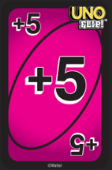 

* Purple cards:

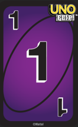 

* Teal cards:

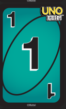

## Action Cards:

* Skip:

   

* Reverse:

   

* Draw One:

   

* Wild:

* Wild Draw two;

* Flip both sides:

 

* Reverse dark side:

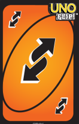 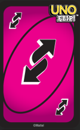 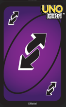 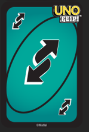

* Draw five:

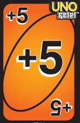  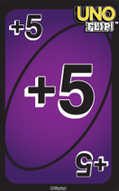 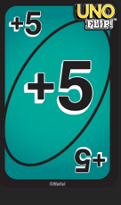

* Skip everyone:s

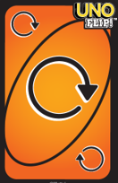 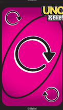 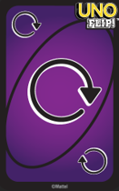 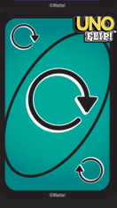

## File Structure:

UnoProject contains:
* .idea/: stores configuration files and built artifacts
* out/: stores the executable java files
* resources/: holds all the .png images that are used in the GUI
* src/:
  * META-INF: stores manifest file for project build
  * Milestone1/: stores code from Milestone 1
    * MainGame.py: Contains the primary game loop and gameplay logic.
    * MainGameTest.py: Contains all the test cases for the code.
    * Player.py: Defines the player class with attributes and methods specific to individual players.
    * Deck.py: Describes the deck class, handling card creation, shuffling, and distribution.
    * Card.py: Contains the card class definition, outlining the properties and behaviors of individual cards.
  * Milestone2/: stores code from Milestone 2
    * Moldel/: holds all model class components
      * CardModel
      * DeckModel
      * MessageConstant
      * PlayerModel
      * UnoFinishEvent
      * UnoGameEvent
      * UnoModel
    * View/: holds all view class components
      * GamePanel
      * InfoPanel
      * PlayerHandPanel
      * PlayerInfoPanel
      * UnoView:
    * UnoController: holds the controller class component
  * Milestone3: stores code from Milestone 3
    * Model/: updated and new model class components for Milestone 3
      * CardModel: Updated with dark and light side card implementations.
      * CardSideModel: New class to handle the properties of the dual-sided cards.
      * DeckModel: Enhanced to manage dual-sided cards.
      * MessageConstant: Updated constants to accommodate new game rules.
      * PlayerModel: Now includes logic for AI player interactions.
      * UnoFinishEvent: Events specific to the end-game scenarios, including AI outcomes.
      * UnoGameEvent: New events related to Uno Flip actions.
      * UnoModel: Core game logic, now with integrated AI decision-making.
      * UnoModelTest: Unit tests for verifying the functionality of the UnoModel with AI integration.
      * View/: updated view class components for Milestone 3
        * GamePanel
        * InfoPanel
        * PlayerHandPanel
        * PlayerInfoPanel
        * UnoView: Now displays AI actions and Uno Flip transitions
  * Milestone4: stores code from Milestone 4
    * Model/: updated and new model class components for Milestone 3
      * CardModel: Updated with dark and light side card implementations.
      * CardSideModel: New class to handle the properties of the dual-sided cards.
      * DeckModel: Enhanced to manage dual-sided cards.
      * DoEvent: Event specific to the redo function
      * MessageConstant: Updated constants to accommodate new game rules.
      * PlayerModel: Now includes logic for AI player interactions.
      * UnoFinishEvent: Events specific to the end-game scenarios, including AI outcomes.
      * UnoGameEvent: New events related to Uno Flip actions.
      * UnoModel: Core game logic, now with integrated AI decision-making.
      * UnoModelTest: Unit tests for verifying the functionality of the UnoModel with AI integration.
      * View/: updated view class components for Milestone 3
        * GamePanel
        * InfoPanel
        * PlayerHandPanel
        * PlayerInfoPanel
        * UnoView: Now displays AI actions and Uno Flip transitions.
* README: stores game setup, instruction, updates, authors, and more.
* SYSC 3110 Project.pdf: stores project instructions
* UnoFlip.iml: file created by IntelliJ
* UnoProject.iml: file created by IntelliJ

## Known Issues:

### Load Game

* Description: The load game is not fully operational. While the game state can be successfully loaded and saved within the model,
there is an issue with updating the view to display the loaded game. As a temporary measure to maintain consistency in 
displayed game, the changes that the loaded game would make in the model have been commented out. Consequently, the loaded
game is not reflected in the GUI, and players may not see the correct state of the game upon loading. 

* Workaround: As a workaround, users can still successfully load and resume their saved games, as the game state is currently
maintained in the model. However, the visual representation of the loaded game may not be accurate due to the commented-out
changes in the view. 

## Milestone 1 Authors:

Ayman Kamran:
* Implemented the Deck, Player, Card class and their associated test classes
* Designed UML Class diagram

Adham Elmahi:
* Implemented MainGame functionalities: user prompts, card validation
* Designed sequence diagram
* Wrote README

Juanita Rodelo:
* Implemented MainGame functionalities: user prompts, card validation, REVERSE action card, SKIP action card
* Wrote MainGame tests
* Wrote README

Rebecca Li:
* Implemented MainGame functionalities: user prompts, card validation, DRAW ONE action card, WILD_DRAW_TWO
  action card, WILD action card, logic behind flow of the game
* Wrote MainGame tests

## Milestone 2 Authors:

Ayman Kamran:
* Added the images of the cards at the bottom panel of the interface
* Added the image of the top card to show its actual design
* Enhanced GUI
* Created UML Class Diagram

Adham Elmahi:
* Created Resources directory to store all the cards
* Added the images of the cards at the bottom panel of the interface
* Added the image of the top card to show its actual design
* Created UML Sequence Diagram

Juanita Rodelo:
* MVC architecture set up
* Developed base code for MVC
* Wild Draw Two Challenge Feature
* User prompt for number of players
* Updated README

Rebecca Li:
* Logic migration to GUI from Milestone 1
* Created EventObject classes
* User prompt for new colour for action cards
* GUI separation files - one file per major GUI component

## Milestone 3 authors:

Adham Elmahi:
* Updated the sequence diagram to include UnoFlip and AI features
* Added Darkside and Lightside flips card images
* Conducted UnoModel testing
* Updated README file for project documentation

Ayman Kamran:
* Documentation for UnoFlip integration and AI Integration
* Performed unit testing for UnoModel as part of Milestone 3
* Implemented GUI enhancements for improved user interaction
* Implemented the UML Class Diagram

Juanita Rodelo:
* Modified `UnoModel` to add AI integration

Rebecca Li:
* Worked on adding UnoFlip functionality
* Worked on AI Implementation

## Milestone 4 authors:

Adham Elmahi:
* Save game capabilities
* Load game capabilities

Ayman Kamran:
* Save game capabilities
* Load game capabilities

Juanita Rodelo:
* Replay game capabilities
* README

Rebecca Li:
* Redo/Undo capabilities 