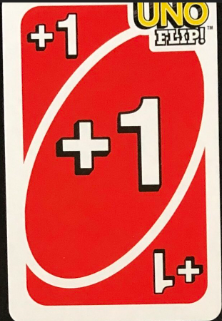
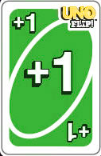
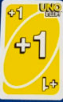
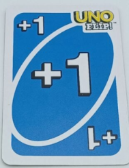
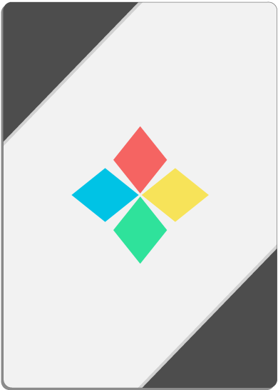
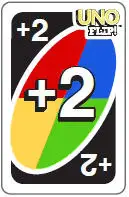

# UnoFlip
This repository will contain an Uno Flip game project for the course SYSC 3110: Software Development Project

## Purpose of the Game:
The objective of this card game is for players to strategically play their cards with the aim of being the
first to exhaust all cards in their hand. Each player starts off with 0 points and when one player has no more cards
to play, they win that round and collect the points associated with the cards of the other opponents. The first player
to reach 500 points wins the entire game.

## Rules:
1) Objective: Be the first player to play all your cards and accumulate 500 points.

2) Gameplay: Players take turns to play a card.
   The card played must match the one currently on top of the deck either by number, color, or action.
   Special cards have unique actions that affect the flow of the game.
   If a player cannot play a card from their hand, they must draw one from the deck. Then they can choose to play the card
   they picked up or the game continues to the next player.
   If a player goes out by using any card that requires the next player to draw, that player must draw the
   appropriate number of cards before the scores are tallied.

3) Playing Cards: To play a specific card, simply click the button with the card image that you wish to play.

4) Scoring:

When a player has played all their cards, they win that round and the hand concludes. This player scores points
based on the cards remaining in their opponents' hands:
* Number cards: Face value
* Draw One: 10 points
* Draw Five, Reverse, Skip, Flip: 20 points
* Skip Everyone: 30 points
* Wild: 40 points
* Wild Draw Two: 50 points
* Wild Draw Color: 60 points

5) Winning: The first player to accumulate 500 points across multiple rounds wins the game.

## Updates:
Milestone 2 brings many updates and new features to this game.
### GUI:
There is now a GUI that users can interact with. This was
done using Java AWT (Abstract Window Toolkit), which is an API to develop graphical user interfaces and Java Swing, which is part
of Java Foundation Classes (JFC) that is used to create window-based applications. The GUI is a JFrame that is comprised of JPanels,
JOptionPane, JComboBox, JLabel, and more.
### MVC:
Now that there is a GUI, a new architecture has been introduced to simplify and optimize user interactions and processing called MVC.
MVC is composed of three parts: Model, View, and Controller. The View component is responsible for housing the user interface
components. The View is what the user interacts with and as a result it interacts with the controller. The
Controller is the component that connects the view and the model. The Controller does not handle the data logic, it tells
the model what to do. The Model component is responsible for the logic behind the game. It responds to the controller's
requests and changes the view accordingly.
### Wild Draw Two Card Challenge:
This milestone brings a new rule to the game. Now, if a player decides to play a wild draw two card the next player that is
due to draw two cards can choose to challenge them. If the player who played this card had no other option than to play this wild
draw two card, then they will be found not guilty, but if they had other card options, then they will be found guilty.

# Cards:
## Colors:
There are four colours within the cards: Red, Green, Yellow and Blue. Some cards of the same color may appear different due to the fact
they were not found from the same source. The following lists what each card color can look like:
* Red Cards:

* Green Cards:

* Yellow Cards:

* Blue Cards:;

## Action Cards:

* Skip:

* Reverse:

* Draw One:

* Wild: 

* Wild Draw two;

## File Structure:

UnoProject contains:
* .idea/: stores configuration files and built artifacts
* out/: stores the executable java files
* resources/: holds all the .png images that are used in the GUI
* src/:
  * META-INF: stores manifest file for project build
  * Milestone1/: stores code from Milestone 1
    * MainGame.py: Contains the primary game loop and gameplay logic.
    * MainGameTest.py: Contains all the test cases for the code.
    * Player.py: Defines the player class with attributes and methods specific to individual players.
    * Deck.py: Describes the deck class, handling card creation, shuffling, and distribution.
    * Card.py: Contains the card class definition, outlining the properties and behaviors of individual cards.
  * Milestone2/: stores code from Milestone 2
    * Moldel/: holds all model class components
      * CardModel
      * DeckModel
      * MessageConstant
      * PlayerModel
      * UnoFinishEvent
      * UnoGameEvent
      * UnoModel
    * View/: holds all view class components
      * GamePanel
      * InfoPanel
      * PlayerHandPanel
      * PlayerInfoPanel
      * UnoView:
    * UnoController: holds the controller class component
* README: stores game setup, instruction, updates, authors, and more.
* SYSC 3110 Project.pdf: stores project instructions
* UnoFlip.iml: file created by IntelliJ
* UnoProject.iml: file created by IntelliJ
  

## Data Structure Explanation:

### CardModel Class:
* The Card class is made up of two enums, one to represent the Colour and one to represent the Type of the card.
  We chose to use enums since they are the easiest to extend and maintain. We know we will need to add colours and
  types in later milestones of this project, so using enums was essential for these attributes. For this milestone,
  there are a set amount of colours and types so we did not want to choose a data structure that allowed for dynamic
  setting and changing of these attributes. They are also type safe, which means that every time we compare them,
  they are guaranteed to not produce an incompatible type error.

### PlayerModel Class:
* Each player has a hand of cards which are represented by an ArrayList. We thought this would be the best data
  structure since the number of cards a player has in their hand is constantly changing every round, so the ability
  to dynamically change this was essential. They start with a fixed length but as the game progresses they draw cards
  and put down cards. They needed the ability to play whatever card they wanted to so random access was another
  requirement for the data structure, and ArrayLists provide this in an efficient manner.

### DeckModel Class:
* We chose to represent the deck object as an ArrayLists of cards because we wanted the ability to dynamically add and
  remove from this structure. We also wanted the ability to check the size and how many cards the deck contains in a
  moment of time. We also wanted to ability to search for elements using the indexOf() method in order to draw from the
  top of the deck. ArrayLists are the simplest data structure that met all of our requirements for the deck.

### UnoModel Class:
* The MainGame class is made up of two main data structures that contain the group of players and the group of cards
  that make up the discard pile. Both of these lists are ArrayLists because we needed to dynamically control the size
  of both lists. The players list depending on how many players the user entered, which we have no control over so this
  needed to be dynamically set. The player list also needed to be able to be randomly accessed since the first player
  is chosen at random. ArrayList provides an O(1) constant time to access elements by index, so this would be done
  efficiently. The discard list is constantly being added to during the duration of the game and emptied at the end,
  so the ability to change the size with the clear() method was a main reason why we chose to use an ArrayList for this
  list.

### MessageConstant Class:
* The MessageConstant class is made up of static final strings because it will never change and a single copy of it can be used throughout the program. 

### UnoFinishEvent / UnoGameEvent Classes:
* Both of the these classes extend the EventObject class because it will act as events that occur during the game. The UnoGameEvent 
class handles events that occur during the game and the UnoFinishEvent class handles the events when a game finishes. 
When these events occur, the model changes in some way so this is reflected in the model which then updates the view accordingly.

### UnoView
* The UnoView class is the main frame of the game, it extends a JFrame and holds all the GUI components. The GUI is made up of two main
panels: a GamePanel and a InfoPanel. These are their own classes to keep the code organized. Both the GamePanel and the InfoPanel
extend JPanels and they contain other panels and other Java Swing components. The player's hand is represented by a JPanel,
it is in a class called PlayerHandPanel. A player's information such as their name and their current score is stored in a class called
PlayerInfoPanel.

* Overall, we primarily chose ArrayLists for the list type data structure in our program because they are the most
  memory efficient and provide the most built-in functionality which would allow us to focus more on the logic of the
  game, and less on the individual data structures ability.

## Roadmap Ahead 
The goal of this project is to extend the current functionality to include the rest of the cards in Uno Flip and to incorporate AI.
The cards in Uno Flip are double-sided so this will be added in the next release of this game. For the AI capabilities, 
the game will offer a number of AI players. This will allow single users to play with a computer instead of real people.

## Milestone 1 Authors:

Ayman Kamran:
* Implemented the Deck, Player, Card class and their associated test classes
* Designed UML Class diagram

Adham Elmahi:
* Implemented MainGame functionalities: user prompts, card validation
* Designed sequence diagram
* Wrote README

Juanita Rodelo:
* Implemented MainGame functionalities: user prompts, card validation, REVERSE action card, SKIP action card
* Wrote MainGame tests
* Wrote README

Rebecca Li:
* Implemented MainGame functionalities: user prompts, card validation, DRAW ONE action card, WILD_DRAW_TWO
  action card, WILD action card, logic behind flow of the game
* Wrote MainGame tests

## Milestone 2 Authors:
Ayman Kamran:
*

Adham Elmahi:
* Created Resources directory to store all the cards
* Added the images of the cards at the bottom panel of the interface 
* Added the image of the top card to show its actual design
* Created sequence diagram

Juanita Rodelo:
* Updated README
* MVC architecture set up
* Developed base code for MVC
* Wild Draw Two Challenge Feature

Rebecca Li:
* Logic migration to GUI from Milestone 1
* GUI separation files - one file per major GUI component